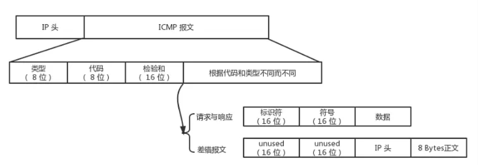
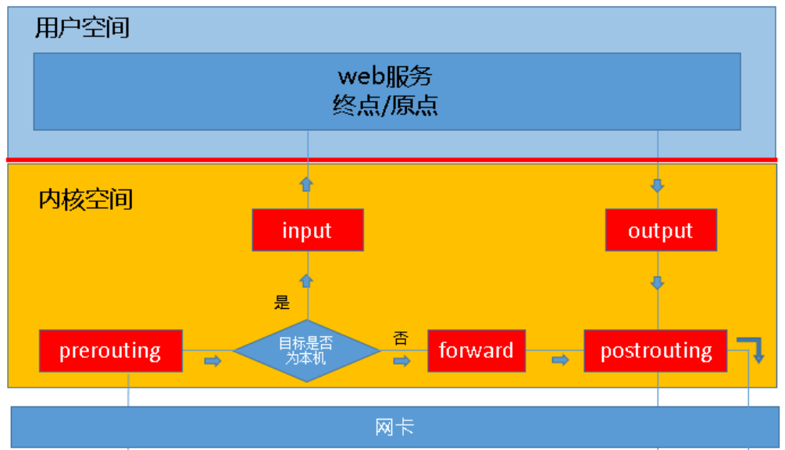

# 通过网络命令学习计算机网络

## 配置Linux系统连接Internet

典型的情形是我们的Linux机器在一个局域网中，局域网中有一个网关，能够让我们的Linux机器访问Internet，那么我们就需要首先给我们的Linux机器上连接到网关的网卡上设置IP地址，然后将这台网关的IP地址设置为Linux机器的默认路由，也称为默认网关。

### 使用ifconfig设置网卡

ifconfig是Linux系统中最常用的一个用来显示和设置网络设备的工具。其中“if”是“interface”的缩写。ifconfig可以用来设置网卡的状态，或是显示当前的设置。 
* 查看网卡的状态
```
ifconfig eth0   # 查看第一块网卡的状态
ifconfig        # 查看所有网卡的状态
```
* 将第一块网卡的IP地址设置为192.168.0.100
```
ifconfig eth0 192.168.0.100
```
对于以太网网卡的默认命名方式为eth0、eth1...
* 同时设置IP地址和子网掩码
```
ifconfig eth0 192.168.0.100 netmask 255.255.255.0 
```
* 暂时关闭或启用网卡
```
ifconfig eth0 down  # 关闭第一块以太网网卡
ifconfig eth0 up    # 启用第一块以太网网卡
```

### 使用route设置默认网关

route命令是用来查看和设置Linux系统的路由信息，以实现与其它网络的通讯。要实现两个不同的子网之间的网络通讯，需要一台连接两个网络路由器或者同时位于两个网络的网关来实现。这里的两个网络典型情况是：一个是我们的机器所在的局域网；另一个是外部的Internet。

* 显示出当前路由表
```
route
```
* 增加一个默认路由
```
route add 192.168.0.1 gw
```
### 配置DNS域名解析服务

我们的Linux系统实际上已经连接到Internet上了，只是我们只能通过IP地址来访问Internet上的网络服务。要想通过域名来来访问Internet上的网络服务，还需要配置DNS域名解析服务，也就是指定DNS服务器的IP地址。

* 参看系统默认DNS配置
```
cat /etc/resolv.conf
```
* 配置系统默认DNS
```
vi /etc/resolv.conf
nameserver 114.114.114.114 # 在/etc/resolv.conf文件里添加一行
```
通过文本编辑器（这里以vi为例，您也可以使用其他方式）打开/etc/resolv.conf 配置文件，添加一行nameserver 114.114.114.114 ，这个DNS服务器IP地址一般使用网络管理员指定的本地DNS服务器IP地址。

至此，我们可以通过域名来来访问Internet上的网络服务，通过浏览器打开网页http://staff.ustc.edu.cn/~mengning/ 测试一下看看吧！如果您的Linux没有图形界面，也可以通过wget命令来下载一个网页。
```
wget http://staff.ustc.edu.cn/~mengning/
```
如果无法打开网页怎么办？在确保IP地址、默认网关和DNS配置正确的情况下，就需要通过网络诊断工具来跟踪网络发现问题。
## 网络诊断工具
### ping

ping是潜水艇人员的专用术语，表示回应的声纳脉冲，在网络ping是一个十分好用的TCP/IP工具————PING(Packet Internet Grope)因特网包探索器。它的主要的功能是用来检测网络的连通情况和分析网络速度，网络通与不通，也叫时延，其值越大，速度越慢。ping发送一个ICMP回声请求消息给目的地并报告是否收到所希望的ICMP回声应答，是用来检查网络是否通畅或者网络连接速度的命令。

ping命令通过使用TCP/IP协议下的ICMP子协议向目标主机(地址)发送一个回声请求数据包，要求目标主机收到请求后给予答复，从而判断本机与目标主机(地址)是否连通，网络响应时间的长短以及传送过程中数据包是否有所丢失。用户可以借助以上信息分析判断出网络中的故障，并找到针对性的解决方法。
### ping命令背后的ICMP协议

执行ping指令会使用ICMP传输协议，发出要求回应的信息，若远端主机的网络功能没有问题，就会回应该信息，因而得知该主机运作正常。所以，在进一步说明ping命令之前，我们不妨先了解下ICMP协议。

在IP通信中，经常有数据包到达不了对方的情况。原因是在通信途中的某处的一个路由器由于不能处理所有的数据包，就将数据包部分或全部丢弃了；或者虽然到达了目的地，但是由于某种原因服务器软件可能不能接收处理它。为了与错误发生的现场联络而飞过来的信鸽就是ICMP报文。在IP网络上，由于数据包被丢弃等原因，为了将必要的信息传递给发送方而诞生了ICMP协议。ICMP协议是为了辅助IP协议交换各种各样的控制信息，可以说ICMP协议分担了IP协议的一部分功能。这也是为什么TCP/IP的框图中一般讲ICMP协议和IP协议一起放在网络层的原因。

ICMP协议有何功能？
* 确认IP包是否成功到达目标地址 ，如果没有告知原因————差错报文；
* 回应对方主机询问的一些问题，比如调查自己网络的子网掩码，取得对方机器的时间信息等，这其实就是包括ping命令的一些功能，主要是请求与响应报文。


图：ICMP协议报文的结构（图片质量不高，可以考虑重画）

根据报文结构，我们来说说两种报文，先说说差错报文。

举一个例子，好比网购商家给另外一个城市的顾客寄送快递。现在快递服务顾客不满意，快递公司或顾客就用ICMP来反映快递寄送的一些情况给商家。常见情况如下：

* Destination Host Unreachable终点不可达：比如我们主机的传输层写错了端口号，结果IP包送过去，到了对方的主机上，对方没有对应的端口接受，就像写错了门牌号快递被退回来了。发快递填写地址出错的情况就更多了，可能是门牌号，可能是小区号，可能干脆省份都写错了，查无此人，只能被退回来。类似的情况在网络就由ICMP汇报为什么送不到，用字段表示：网络不可达代码为0，主机不可达代码为1，协议不可达代码为2，端口不可达代码为3，需要进行分片但设置了不分片位代码为4，等等。
* 源点抑制：这个就是说，快递送的太多了，拆快递都来不及了，叫我们这里送慢点，别一次性送这么多过来。
* Request Timed Out时间超时：快递在路上耽搁太久，时间超时了，或者快递员直接偷了快递跑路了。也就是IP包超过时间（TTL）还没到达，为了不让它继续在网络中游荡堵塞网络，所以它就自行销毁了。
* 路由重定向：是发给另外一个路由器的。也就是相当于，上次快递交给一个中转站，那个中转站的人莫名其妙去绕了远路（路由算法有问题），导致东西送到顾客手上很晚了，顾客投诉了，这次特地来告诉那个中转站的负责人，下次要找一条好走的路（重新更新路由表）。

说完了差错报文，现在来说说另外一个，也就是请求与响应报文。这就进入了我们今天的主题——ping命令。

ping命令用来在IP层次上调查与指定机器是否连通，调查数据包发送和响应需要多少时间。为了实现这个功能，ping命令使用了两个ICMP报文。主机的ping发送一个ICMP请求报文，对方主机收到之后，也用ICMP发送一个响应报文，这样就能检测网络是否畅通，同时利用发送请求报文和接收响应报文之间的时间间隔来评估网络速度怎么样。就像我往山那头的人家喊一句，看什么时候有回声，如果始终没回声，那就是不在家。如果过了一会儿有回声，那么我们就可以根据回声的快慢来推断我们两人之间距离有多少。

具体来说，ping命令是怎么样使用ICMP协议的呢？
* 我方主机先发送一个为ping量身打造的ICMP请求报文————增加了标识符和序号字段。这两个新增加的字段，是用来标识各个不同的ICMP报文。标识符是表示某一批送出的ICMP报文，同一批送出的都是一样的标识符。序号字段则是表示这是送出的第几个包，每送出一个就增加1。
* 对方主机收到之后，就做了一点小小的工作，把源地址和目标地址交换了一下，然后再把类型字段改成0，表示这个是响应报文，然后就原封不动地送回来了。这就好像是我送了个快递到别人家，别人把地址交换了下，改成我是收件人，就直接叫快递员原封不动地退回来了。
* 我方主机收到响应报文的时间减去发送请求报文的时间就可以计算出两个主机之间的网络延时。

### 网络故障排查中ping的使用
* 网络故障排查的顺序

网络故障大体可以分为系统IP设置、网卡、网关和线路故障几个方面。正常情况下，当用户使用ping命令来检测网络运行情况和查找网络故障时，往往需要调用许多ping命令。按照一定的顺序规则使用该命令将快速找到问题所在，通常按照本地循环地址、本地IP地址、默认网关地址、远程IP地址、域名的顺序依次进行排查。

* 常见返回信息

在使用ping命令进行网络故障排查时，经常会遇到各种各样的返回信息。了解每种信息表示的含义以及可能导致该信息产生的原因，将有助于用户有效地排查网络故障。下面对一些常见的返回信息进行简单的说明。

  * Request Timed Out
该信息表示没有收到对方主机的回应导致请求超时。出现这种信息的原因大体包括：目标机器设置了ICMP数据包过滤如设置了防火墙、目标机器已经关机、IP地址不正确以及网关设置错误等。
  * Destination Host Unreachable
该信息表示无法与主机建立连接或该主机根本就不存在。通常这种情况的产生是由于局域网中DHCP无法正常分配IP导致，也就是本机网络设置有问题。
  * Unknown Host
该信息表示未知主机，错误的域名或线路故障可能导致不能被域名服务器解析成IP，从而产生了该返回信息，这时应该关注DNS的配置是否有问题。
  * TTL Expired in Transit
该信息表示TTL过期。造成该问题的主要原因是在网络内部出现了路由循环从而致使数据包无法到达目的主机。
  * Bad IP Address
该信息表示IP地址本身就不存在或者DNS服务器无法解析该地址。
### ping命令举例
* 测试某网站的连通性
```
ping  www.163.com
ping  114.114.114.114
```
* 指定ping的次数为10次
```
ping -c 10 -i 0.6 www.163.com
```
* 每隔0.6秒ping一次，一共ping 10次
```
ping -c 10 www.163.com
```
* 设置发送包的大小为1024
```
ping -s 1024 www.163.com
```

## 网络管理

### iptables
简介toto
### iptable的基本原理
iptables有5种chain：
* PREROUTING:数据包进入路由表之前
* INPUT:通过路由表后目的地为本机
* FORWARDING:通过路由表后，目的地不为本机
* OUTPUT:由本机产生，向外转发
* POSTROUTIONG:发送到网卡接口之前。

将报文的处理过程大致分成三类，每类报文会经过不同的chain：

* 到本机某进程的报文：PREROUTING --> INPUT
* 由本机转发的报文：PREROUTING --> FORWARD --> POSTROUTING
* 由本机的某进程发出报文（通常为响应报文）：OUTPUT --> POSTROUTING


图：iptables的5种chain和3类处理过程（图片需要修改，将“web服务终点/原点”改为“网络应用程序”）

为了方便管理，把具有相同功能的规则的集合叫做table，不同功能的规则，放置在不同的table中进行管理，iptables中定义了4种table。四种表的功能为
* filter表：负责过滤功能，防火墙；内核模块：iptables_filter
* nat表：network address translation，网络地址转换功能；内核模块：iptable_nat
* mangle表：拆解报文，做出修改，并重新封装 的功能；iptable_mangle
* raw表：关闭nat表上启用的连接追踪机制；iptable_raw
四种table处理顺序由先到后为：raw→mangle→nat→filter。但除了OUTPUT外有全部的四种表规则外，其他的chain只有两三个表规则。
* PREROUTING ：raw表，mangle表，nat表
* INPUT ：mangle表，filter表，（centos7中还有nat表，centos6中没有）
* FORWARD：mangle表，filter表
* OUTPUT：raw表，mangle表，nat表，filter表
* POSTROUTING：mangle表，nat表


图：iptables的5种chain和4种tables （图片来源于网络，考虑重新配色）
### iptables的基本用法
todo
### iptables的典型应用举例（该部分未经实验验证）

* 禁止别人ping入，以防浪费服务器资源
```
iptables -t filter -A INPUT -p icmp --icmp-type 0 -j ACCEPT
iptables -t filter -A OUTPUT -p icmp --icmp-type 8 -j ACCEPT
```
* 丢弃eth0网卡收到来自 192.168.1.0/24 的 1024:65535 端口的访问本机 ssh 端口的数据包
```
iptables -A INPUT -i eth0 -p tcp -s 192.168.1.0/24 --sport 1024:65535 --dport ssh -j DROP
```
## 网络测绘

### nmap
在著名的黑客专用操作系统KaliLinux中有很多非常强大的工具，其中就包括nmap。根据名字我们大致可以猜测一下，n可能代表network，那么难道它可以画出“网络地图”或者说“网络拓扑图” ？让我们先来看一下它的参数说明。

通过下面的命令查看nmap的使用方法
```
$ nmap --help

Nmap 7.60 ( https://nmap.org )
Usage: nmap [Scan Type(s)] [Options] {target specification}
TARGET SPECIFICATION:
  Can pass hostnames, IP addresses, networks, etc.
  Ex: scanme.nmap.org, microsoft.com/24, 192.168.0.1; 10.0.0-255.1-254
  -iL <inputfilename>: Input from list of hosts/networks
  -iR <num hosts>: Choose random targets
  --exclude <host1[,host2][,host3],...>: Exclude hosts/networks
  --excludefile <exclude_file>: Exclude list from file
HOST DISCOVERY:
  -sL: List Scan - simply list targets to scan
  -sn: Ping Scan - disable port scan
  -Pn: Treat all hosts as online -- skip host discovery
  -PS/PA/PU/PY[portlist]: TCP SYN/ACK, UDP or SCTP discovery to given ports
  -PE/PP/PM: ICMP echo, timestamp, and netmask request discovery probes
  -PO[protocol list]: IP Protocol Ping
  -n/-R: Never do DNS resolution/Always resolve [default: sometimes]
  --dns-servers <serv1[,serv2],...>: Specify custom DNS servers
  --system-dns: Use OS's DNS resolver
  --traceroute: Trace hop path to each host
SCAN TECHNIQUES:
  -sS/sT/sA/sW/sM: TCP SYN/Connect()/ACK/Window/Maimon scans
  -sU: UDP Scan
  -sN/sF/sX: TCP Null, FIN, and Xmas scans
  --scanflags <flags>: Customize TCP scan flags
  -sI <zombie host[:probeport]>: Idle scan
  -sY/sZ: SCTP INIT/COOKIE-ECHO scans
  -sO: IP protocol scan
  -b <FTP relay host>: FTP bounce scan
PORT SPECIFICATION AND SCAN ORDER:
  -p <port ranges>: Only scan specified ports
    Ex: -p22; -p1-65535; -p U:53,111,137,T:21-25,80,139,8080,S:9
  --exclude-ports <port ranges>: Exclude the specified ports from scanning
  -F: Fast mode - Scan fewer ports than the default scan
  -r: Scan ports consecutively - don't randomize
  --top-ports <number>: Scan <number> most common ports
  --port-ratio <ratio>: Scan ports more common than <ratio>
SERVICE/VERSION DETECTION:
  -sV: Probe open ports to determine service/version info
  --version-intensity <level>: Set from 0 (light) to 9 (try all probes)
  --version-light: Limit to most likely probes (intensity 2)
  --version-all: Try every single probe (intensity 9)
  --version-trace: Show detailed version scan activity (for debugging)
SCRIPT SCAN:
  -sC: equivalent to --script=default
  --script=<Lua scripts>: <Lua scripts> is a comma separated list of
           directories, script-files or script-categories
  --script-args=<n1=v1,[n2=v2,...]>: provide arguments to scripts
  --script-args-file=filename: provide NSE script args in a file
  --script-trace: Show all data sent and received
  --script-updatedb: Update the script database.
  --script-help=<Lua scripts>: Show help about scripts.
           <Lua scripts> is a comma-separated list of script-files or
           script-categories.
OS DETECTION:
  -O: Enable OS detection
  --osscan-limit: Limit OS detection to promising targets
  --osscan-guess: Guess OS more aggressively
TIMING AND PERFORMANCE:
  Options which take <time> are in seconds, or append 'ms' (milliseconds),
  's' (seconds), 'm' (minutes), or 'h' (hours) to the value (e.g. 30m).
  -T<0-5>: Set timing template (higher is faster)
  --min-hostgroup/max-hostgroup <size>: Parallel host scan group sizes
  --min-parallelism/max-parallelism <numprobes>: Probe parallelization
  --min-rtt-timeout/max-rtt-timeout/initial-rtt-timeout <time>: Specifies
      probe round trip time.
  --max-retries <tries>: Caps number of port scan probe retransmissions.
  --host-timeout <time>: Give up on target after this long
  --scan-delay/--max-scan-delay <time>: Adjust delay between probes
  --min-rate <number>: Send packets no slower than <number> per second
  --max-rate <number>: Send packets no faster than <number> per second
FIREWALL/IDS EVASION AND SPOOFING:
  -f; --mtu <val>: fragment packets (optionally w/given MTU)
  -D <decoy1,decoy2[,ME],...>: Cloak a scan with decoys
  -S <IP_Address>: Spoof source address
  -e <iface>: Use specified interface
  -g/--source-port <portnum>: Use given port number
  --proxies <url1,[url2],...>: Relay connections through HTTP/SOCKS4 proxies
  --data <hex string>: Append a custom payload to sent packets
  --data-string <string>: Append a custom ASCII string to sent packets
  --data-length <num>: Append random data to sent packets
  --ip-options <options>: Send packets with specified ip options
  --ttl <val>: Set IP time-to-live field
  --spoof-mac <mac address/prefix/vendor name>: Spoof your MAC address
  --badsum: Send packets with a bogus TCP/UDP/SCTP checksum
OUTPUT:
  -oN/-oX/-oS/-oG <file>: Output scan in normal, XML, s|<rIpt kIddi3,
     and Grepable format, respectively, to the given filename.
  -oA <basename>: Output in the three major formats at once
  -v: Increase verbosity level (use -vv or more for greater effect)
  -d: Increase debugging level (use -dd or more for greater effect)
  --reason: Display the reason a port is in a particular state
  --open: Only show open (or possibly open) ports
  --packet-trace: Show all packets sent and received
  --iflist: Print host interfaces and routes (for debugging)
  --append-output: Append to rather than clobber specified output files
  --resume <filename>: Resume an aborted scan
  --stylesheet <path/URL>: XSL stylesheet to transform XML output to HTML
  --webxml: Reference stylesheet from Nmap.Org for more portable XML
  --no-stylesheet: Prevent associating of XSL stylesheet w/XML output
MISC:
  -6: Enable IPv6 scanning
  -A: Enable OS detection, version detection, script scanning, and traceroute
  --datadir <dirname>: Specify custom Nmap data file location
  --send-eth/--send-ip: Send using raw ethernet frames or IP packets
  --privileged: Assume that the user is fully privileged
  --unprivileged: Assume the user lacks raw socket privileges
  -V: Print version number
  -h: Print this help summary page.
EXAMPLES:
  nmap -v -A scanme.nmap.org
  nmap -v -sn 192.168.0.0/16 10.0.0.0/8
  nmap -v -iR 10000 -Pn -p 80
SEE THE MAN PAGE (https://nmap.org/book/man.html) FOR MORE OPTIONS AND EXAMPLES
```
点开后先不要被密密麻麻的字母吓到，我们仔细观察一下后不难发现，nmap有多种不同的功能，并且每种功能都有详细的参数说明以及示例。简单总结一下nmap包含四项基本功能：

* 主机发现（Host Discovery）
* 端口扫描（Port Scanning）
* 版本侦测（Version Detection）
* 操作系统侦测（Operating System Detection）

下面我将依次演示不同功能的使用方法。

#### 主机发现

主机发现就是看看互联网上某个主机是不是在线。原理和ping命令类似，发送探测包到目标主机。如果收到了回复，那么目标主机是开启的。
```
$ nmap -sn www.ustc.edu.cn

Starting Nmap 7.60 ( https://nmap.org ) at 2019-11-28 22:26 CST
Nmap scan report for www.ustc.edu.cn (218.22.21.21)
Host is up (0.023s latency).
rDNS record for 218.22.21.21: 21.21.22.218.broad.static.hf.ah.cndata.com
Nmap done: 1 IP address (1 host up) scanned in 0.13 seconds
```
以上命令可以看到主机www.ustc.edu.cn是在线的。

#### 端口扫描

端口扫描就是查看目标主机开放了哪些端口。找到开放的端口往往可以为入侵提供决策依据。在使用命令演示之前先解释一下参数的含义。-sS表示使用TCP SYN方式扫描TCP端口；-sU表示扫描UDP端口；-T4表示时间级别配置4级；--top-ports 10表示扫描最有可能开放的10个端口
```
$ nmap –sS –sU –T4 –top-ports 10 www.ustc.edu.cn

Nmap scan report for www.ustc.edu.cn (218.22.21.21)
Host is up (0.021s latency).
rDNS record for 218.22.21.21: 21.21.22.218.broad.static.hf.ah.cndata.com
Not shown: 995 filtered ports
PORT     STATE SERVICE
80/tcp   open  http
443/tcp  open  https
3000/tcp open  ppp
8000/tcp open  http-alt
8443/tcp open  https-alt
```

#### 版本侦测

版本侦测可以探测出主机使用的软件版本。
```
$ nmap -sV www.ustc.edu.cn

Nmap scan report for www.ustc.edu.cn (218.22.21.21)
Host is up (0.018s latency).
rDNS record for 218.22.21.21: 21.21.22.218.broad.static.hf.ah.cndata.com
Not shown: 995 filtered ports
PORT     STATE SERVICE    VERSION
80/tcp   open  http       nginx
443/tcp  open  ssl/http   nginx
3000/tcp open  http       nginx
8000/tcp open  http       Apache httpd 2.2.15 ((CentOS))
8443/tcp open  tcpwrapped
```
可以看到主机www.ustc.edu.cn使用了nginx等软件服务。

#### 操作系统探测

nmap可以检测出主机使用的是什么操作系统。当然目标主机自己不会告诉你它是什么系统的主机，得靠nmap来仔细分辨目标主机的”口音“。由于互联网中许多协议在不同操作系统中实现略有差异，因此可以根据这些差异来分辨操作系统。需要root权限来执行操作系统探测命令。
```
$ nmap -O www.ustc.edu.cn

TCP/IP fingerprinting (for OS scan) requires root privileges.
QUITTING!

$ sudo nmap -O www.ustc.edu.cn

Starting Nmap 7.60 ( https://nmap.org ) at 2019-11-28 22:47 CST
Nmap scan report for www.ustc.edu.cn (218.22.21.21)
Host is up (0.020s latency).
rDNS record for 218.22.21.21: 21.21.22.218.broad.static.hf.ah.cndata.com
Not shown: 995 filtered ports
PORT     STATE SERVICE
80/tcp   open  http
443/tcp  open  https
3000/tcp open  ppp
8000/tcp open  http-alt
8443/tcp open  https-alt
Warning: OSScan results may be unreliable because we could not find at least 1 open and 1 closed port
Device type: general purpose
Running: Linux 3.X
OS CPE: cpe:/o:linux:linux_kernel:3.10
OS details: Linux 3.10
```
可以看出主机www.ustc.edu.cn运行的是linux系统，但内核版本只有3.X，而现在的最新版本基本都5.X。这也不足为奇，因为目标主机是一台服务器，更看重稳定性。
